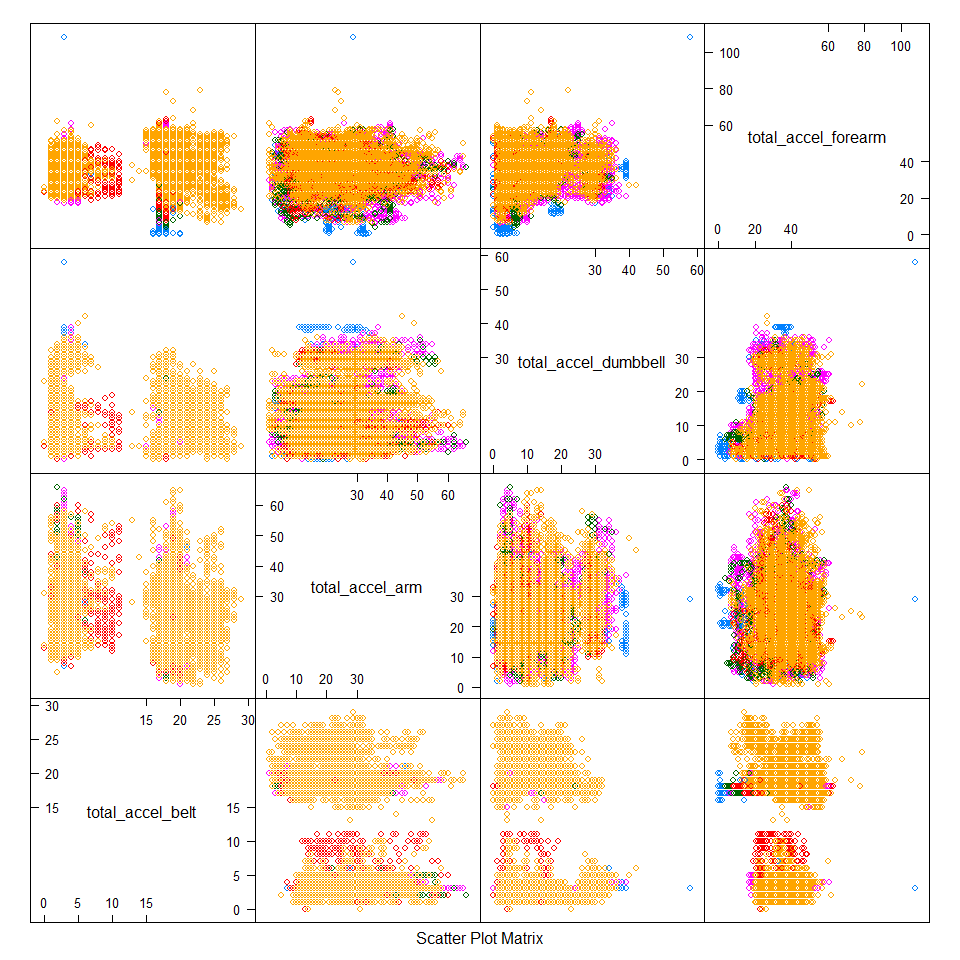
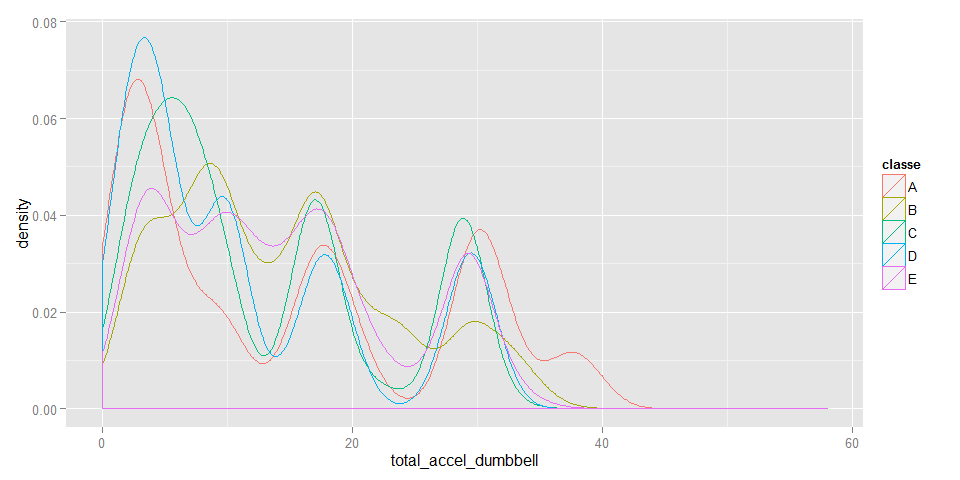
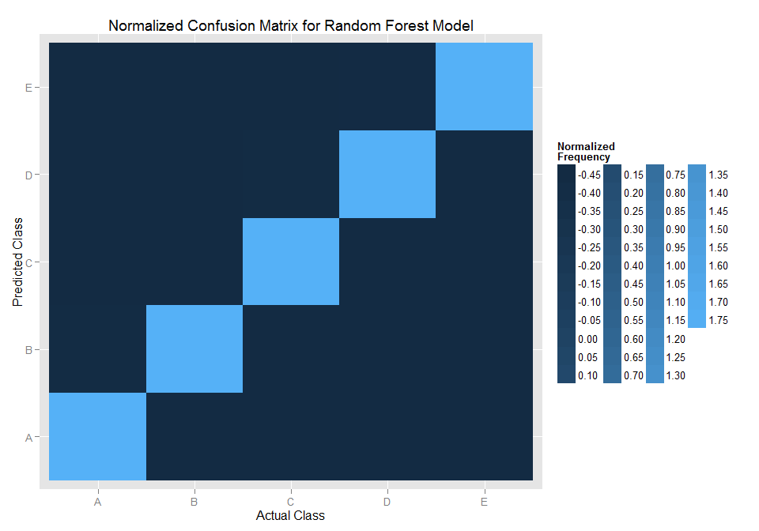

# Practical Machine Learning - Course Project Writeup
Megan  
Sunday, July 26, 2015  

#### **Components of a predictor:** question -> data -> features -> algorithm -> parameters -> evaluation

## Question

The goal of this project is to predict the manner in which 6 participants performed barbell lifts (correctly and incorrectly in 5 different ways) using data collected from accelerometers on the belt, forearm, arm and dumbbell.  In other words, this prediction model will attempt to determine how well an activity was performed by the wearer.

## Input Data

Download the [training](https://d396qusza40orc.cloudfront.net/predmachlearn/pml-training.csv) and [test](https://d396qusza40orc.cloudfront.net/predmachlearn/pml-testing.csv) datasets obtained from the [Weight Lifting Exercises](http://groupware.les.inf.puc-rio.br/har#weight_lifting_exercises) into the working directory. Then, read the local files into R:


```r
training <- read.csv("pml-training.csv")
testing <- read.csv("pml-testing.csv")
```

## Features

Explore the data to determine which features are relevant in predicting activity quality (classe) from activity monitors:


```r
str(training[,1:45])
```

```
## 'data.frame':	19622 obs. of  45 variables:
##  $ X                   : int  1 2 3 4 5 6 7 8 9 10 ...
##  $ user_name           : Factor w/ 6 levels "adelmo","carlitos",..: 2 2 2 2 2 2 2 2 2 2 ...
##  $ raw_timestamp_part_1: int  1323084231 1323084231 1323084231 1323084232 1323084232 1323084232 1323084232 1323084232 1323084232 1323084232 ...
##  $ raw_timestamp_part_2: int  788290 808298 820366 120339 196328 304277 368296 440390 484323 484434 ...
##  $ cvtd_timestamp      : Factor w/ 20 levels "02/12/2011 13:32",..: 9 9 9 9 9 9 9 9 9 9 ...
##  $ new_window          : Factor w/ 2 levels "no","yes": 1 1 1 1 1 1 1 1 1 1 ...
##  $ num_window          : int  11 11 11 12 12 12 12 12 12 12 ...
##  $ roll_belt           : num  1.41 1.41 1.42 1.48 1.48 1.45 1.42 1.42 1.43 1.45 ...
##  $ pitch_belt          : num  8.07 8.07 8.07 8.05 8.07 8.06 8.09 8.13 8.16 8.17 ...
##  $ yaw_belt            : num  -94.4 -94.4 -94.4 -94.4 -94.4 -94.4 -94.4 -94.4 -94.4 -94.4 ...
##  $ total_accel_belt    : int  3 3 3 3 3 3 3 3 3 3 ...
##  $ kurtosis_roll_belt  : Factor w/ 397 levels "","-0.016850",..: 1 1 1 1 1 1 1 1 1 1 ...
##  $ kurtosis_picth_belt : Factor w/ 317 levels "","-0.021887",..: 1 1 1 1 1 1 1 1 1 1 ...
##  $ kurtosis_yaw_belt   : Factor w/ 2 levels "","#DIV/0!": 1 1 1 1 1 1 1 1 1 1 ...
##  $ skewness_roll_belt  : Factor w/ 395 levels "","-0.003095",..: 1 1 1 1 1 1 1 1 1 1 ...
##  $ skewness_roll_belt.1: Factor w/ 338 levels "","-0.005928",..: 1 1 1 1 1 1 1 1 1 1 ...
##  $ skewness_yaw_belt   : Factor w/ 2 levels "","#DIV/0!": 1 1 1 1 1 1 1 1 1 1 ...
##  $ max_roll_belt       : num  NA NA NA NA NA NA NA NA NA NA ...
##  $ max_picth_belt      : int  NA NA NA NA NA NA NA NA NA NA ...
##  $ max_yaw_belt        : Factor w/ 68 levels "","-0.1","-0.2",..: 1 1 1 1 1 1 1 1 1 1 ...
##  $ min_roll_belt       : num  NA NA NA NA NA NA NA NA NA NA ...
##  $ min_pitch_belt      : int  NA NA NA NA NA NA NA NA NA NA ...
##  $ min_yaw_belt        : Factor w/ 68 levels "","-0.1","-0.2",..: 1 1 1 1 1 1 1 1 1 1 ...
##  $ amplitude_roll_belt : num  NA NA NA NA NA NA NA NA NA NA ...
##  $ amplitude_pitch_belt: int  NA NA NA NA NA NA NA NA NA NA ...
##  $ amplitude_yaw_belt  : Factor w/ 4 levels "","#DIV/0!","0.00",..: 1 1 1 1 1 1 1 1 1 1 ...
##  $ var_total_accel_belt: num  NA NA NA NA NA NA NA NA NA NA ...
##  $ avg_roll_belt       : num  NA NA NA NA NA NA NA NA NA NA ...
##  $ stddev_roll_belt    : num  NA NA NA NA NA NA NA NA NA NA ...
##  $ var_roll_belt       : num  NA NA NA NA NA NA NA NA NA NA ...
##  $ avg_pitch_belt      : num  NA NA NA NA NA NA NA NA NA NA ...
##  $ stddev_pitch_belt   : num  NA NA NA NA NA NA NA NA NA NA ...
##  $ var_pitch_belt      : num  NA NA NA NA NA NA NA NA NA NA ...
##  $ avg_yaw_belt        : num  NA NA NA NA NA NA NA NA NA NA ...
##  $ stddev_yaw_belt     : num  NA NA NA NA NA NA NA NA NA NA ...
##  $ var_yaw_belt        : num  NA NA NA NA NA NA NA NA NA NA ...
##  $ gyros_belt_x        : num  0 0.02 0 0.02 0.02 0.02 0.02 0.02 0.02 0.03 ...
##  $ gyros_belt_y        : num  0 0 0 0 0.02 0 0 0 0 0 ...
##  $ gyros_belt_z        : num  -0.02 -0.02 -0.02 -0.03 -0.02 -0.02 -0.02 -0.02 -0.02 0 ...
##  $ accel_belt_x        : int  -21 -22 -20 -22 -21 -21 -22 -22 -20 -21 ...
##  $ accel_belt_y        : int  4 4 5 3 2 4 3 4 2 4 ...
##  $ accel_belt_z        : int  22 22 23 21 24 21 21 21 24 22 ...
##  $ magnet_belt_x       : int  -3 -7 -2 -6 -6 0 -4 -2 1 -3 ...
##  $ magnet_belt_y       : int  599 608 600 604 600 603 599 603 602 609 ...
##  $ magnet_belt_z       : int  -313 -311 -305 -310 -302 -312 -311 -313 -312 -308 ...
```

As observed, the initial descriptive variables (columns 1-7) and those containing missing values (including factor variables) are not useful for building this model. Therefore, select only the appropriate columns from the datasets:


```r
train <- training[,grep("^roll|^pitch|^yaw|^total|^gyros|^accel|^magnet|classe", names(training))]
test <- testing[,grep("^roll|^pitch|^yaw|^total|^gyros|^accel|^magnet|problem", names(testing))]
```

The remaining 52 predictors (down from 159) represent different angles of movement (roll, pitch and yaw) and 3-axis inertial measurements (acceleration, gyroscope and magnetometer) for 4 sensors' orientation (belt, arm, dumbbell and forearm). None of these covariates have (near) zero variance:


```r
library(caret)
library(knitr)
kable(nearZeroVar(train, saveMetrics=TRUE), align="l")
```

                       freqRatio   percentUnique   zeroVar   nzv   
---------------------  ----------  --------------  --------  ------
roll_belt              1.101904    6.7781062       FALSE     FALSE 
pitch_belt             1.036083    9.3772296       FALSE     FALSE 
yaw_belt               1.058480    9.9734991       FALSE     FALSE 
total_accel_belt       1.063160    0.1477933       FALSE     FALSE 
gyros_belt_x           1.058651    0.7134849       FALSE     FALSE 
gyros_belt_y           1.144000    0.3516461       FALSE     FALSE 
gyros_belt_z           1.066214    0.8612782       FALSE     FALSE 
accel_belt_x           1.055412    0.8357966       FALSE     FALSE 
accel_belt_y           1.113725    0.7287738       FALSE     FALSE 
accel_belt_z           1.078767    1.5237998       FALSE     FALSE 
magnet_belt_x          1.090141    1.6664968       FALSE     FALSE 
magnet_belt_y          1.099689    1.5187035       FALSE     FALSE 
magnet_belt_z          1.006369    2.3290184       FALSE     FALSE 
roll_arm               52.338462   13.5256345      FALSE     FALSE 
pitch_arm              87.256410   15.7323412      FALSE     FALSE 
yaw_arm                33.029126   14.6570176      FALSE     FALSE 
total_accel_arm        1.024526    0.3363572       FALSE     FALSE 
gyros_arm_x            1.015504    3.2769341       FALSE     FALSE 
gyros_arm_y            1.454369    1.9162165       FALSE     FALSE 
gyros_arm_z            1.110687    1.2638875       FALSE     FALSE 
accel_arm_x            1.017341    3.9598410       FALSE     FALSE 
accel_arm_y            1.140187    2.7367241       FALSE     FALSE 
accel_arm_z            1.128000    4.0362858       FALSE     FALSE 
magnet_arm_x           1.000000    6.8239731       FALSE     FALSE 
magnet_arm_y           1.056818    4.4439914       FALSE     FALSE 
magnet_arm_z           1.036364    6.4468454       FALSE     FALSE 
roll_dumbbell          1.022388    84.2065029      FALSE     FALSE 
pitch_dumbbell         2.277372    81.7449801      FALSE     FALSE 
yaw_dumbbell           1.132231    83.4828254      FALSE     FALSE 
total_accel_dumbbell   1.072634    0.2191418       FALSE     FALSE 
gyros_dumbbell_x       1.003268    1.2282132       FALSE     FALSE 
gyros_dumbbell_y       1.264957    1.4167771       FALSE     FALSE 
gyros_dumbbell_z       1.060100    1.0498420       FALSE     FALSE 
accel_dumbbell_x       1.018018    2.1659362       FALSE     FALSE 
accel_dumbbell_y       1.053061    2.3748853       FALSE     FALSE 
accel_dumbbell_z       1.133333    2.0894914       FALSE     FALSE 
magnet_dumbbell_x      1.098266    5.7486495       FALSE     FALSE 
magnet_dumbbell_y      1.197740    4.3012945       FALSE     FALSE 
magnet_dumbbell_z      1.020833    3.4451126       FALSE     FALSE 
roll_forearm           11.589286   11.0895933      FALSE     FALSE 
pitch_forearm          65.983051   14.8557741      FALSE     FALSE 
yaw_forearm            15.322835   10.1467740      FALSE     FALSE 
total_accel_forearm    1.128928    0.3567424       FALSE     FALSE 
gyros_forearm_x        1.059273    1.5187035       FALSE     FALSE 
gyros_forearm_y        1.036553    3.7763735       FALSE     FALSE 
gyros_forearm_z        1.122917    1.5645704       FALSE     FALSE 
accel_forearm_x        1.126437    4.0464784       FALSE     FALSE 
accel_forearm_y        1.059406    5.1116094       FALSE     FALSE 
accel_forearm_z        1.006250    2.9558659       FALSE     FALSE 
magnet_forearm_x       1.012346    7.7667924       FALSE     FALSE 
magnet_forearm_y       1.246914    9.5403119       FALSE     FALSE 
magnet_forearm_z       1.000000    8.5771073       FALSE     FALSE 
classe                 1.469581    0.0254816       FALSE     FALSE 

For exploratory purposes, plot the total acceleration for all sensors:


```r
featurePlot(x=train[,c(4,17,30,43)], y=train$classe, plot="pairs")
```

 

Not surprisingly, the belt distribution appears to be different from the other sensors measuring bicep curls. Moreover, there does not appear to be a clear linear relationship.

Evaluate just the dumbbell for illustration:


```r
qplot(total_accel_dumbbell, color=classe, data=train, geom="density")
```

 

Interestingly, there is a different pattern of acceleration for each class:

- A - exercise performed exactly according to the specification
- B - throwing the elbows to the front
- C - lifting the dumbbell only halfway
- D - lowering the dumbbell only halfway
- E - throwing the hips to the front

## Algorithm

Based on these insights, a non-linear machine learning algorithm will be developed without data transformations or principal component analysis (PCA) pre-processing. Since accuracy and performance are important for this assignment, random forests and boosting approaches will be explored.

Use the train set to split data further into 75% trainCV and 25% testCV for cross-validation:


```r
set.seed(2873)
inTrain <- createDataPartition(y=train$classe, p=0.75, list=FALSE)
trainCV <- train[inTrain,]
testCV <- train[-inTrain,]
```

Build model on the trainCV data:


```r
set.seed(2378)
library(randomForest)
RFM <-randomForest(classe ~ ., data=trainCV)
RFM
```

```
## 
## Call:
##  randomForest(formula = classe ~ ., data = trainCV) 
##                Type of random forest: classification
##                      Number of trees: 500
## No. of variables tried at each split: 7
## 
##         OOB estimate of  error rate: 0.54%
## Confusion matrix:
##      A    B    C    D    E  class.error
## A 4183    2    0    0    0 0.0004778973
## B   12 2828    8    0    0 0.0070224719
## C    0   13 2550    4    0 0.0066225166
## D    0    0   31 2379    2 0.0136815920
## E    0    0    2    5 2699 0.0025868441
```

## Evaluation

Perform validation on the testCV set:


```r
CM <- confusionMatrix(testCV$classe, predict(RFM, testCV))
CM
```

```
## Confusion Matrix and Statistics
## 
##           Reference
## Prediction    A    B    C    D    E
##          A 1394    0    0    0    1
##          B    8  941    0    0    0
##          C    0    1  854    0    0
##          D    0    0    8  795    1
##          E    0    0    0    5  896
## 
## Overall Statistics
##                                           
##                Accuracy : 0.9951          
##                  95% CI : (0.9927, 0.9969)
##     No Information Rate : 0.2859          
##     P-Value [Acc > NIR] : < 2.2e-16       
##                                           
##                   Kappa : 0.9938          
##  Mcnemar's Test P-Value : NA              
## 
## Statistics by Class:
## 
##                      Class: A Class: B Class: C Class: D Class: E
## Sensitivity            0.9943   0.9989   0.9907   0.9938   0.9978
## Specificity            0.9997   0.9980   0.9998   0.9978   0.9988
## Pos Pred Value         0.9993   0.9916   0.9988   0.9888   0.9945
## Neg Pred Value         0.9977   0.9997   0.9980   0.9988   0.9995
## Prevalence             0.2859   0.1921   0.1758   0.1631   0.1831
## Detection Rate         0.2843   0.1919   0.1741   0.1621   0.1827
## Detection Prevalence   0.2845   0.1935   0.1743   0.1639   0.1837
## Balanced Accuracy      0.9970   0.9985   0.9952   0.9958   0.9983
```

 

The prediction accuracy of this model is estimated at 0.9951 or 99.51%, so the expected out of sample error is 1 - 0.9951 or 0.49%.  

*Note: with random forests there is no need for cross-validation or a separate test set because the out-of-bag (oob) estimate is an unbiased estimate of the test set error.*


```r
answers <- as.character(predict(RFM, test))
answer <- t(data.frame(answers))
colnames(answer) <- 1:20
kable(answer)
```

          1    2    3    4    5    6    7    8    9    10   11   12   13   14   15   16   17   18   19   20 
--------  ---  ---  ---  ---  ---  ---  ---  ---  ---  ---  ---  ---  ---  ---  ---  ---  ---  ---  ---  ---
answers   B    A    B    A    A    E    D    B    A    A    B    C    B    A    E    E    A    B    B    B  

The actual out of sample error (fraction incorrect in categorical outcomes for the original test set) was 0/20 or 0% with 100% accuracy. This is likely due to the small size of the data partition.

*Note: other machine learning algorithms were not included in this report because they did not perform as well or better.*
